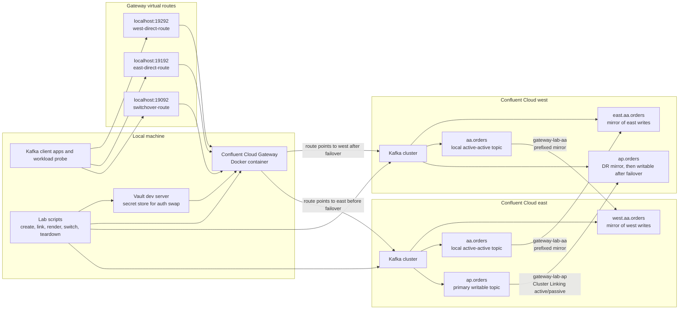
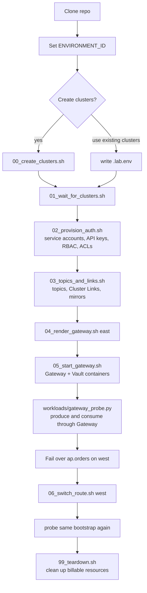

# Confluent Cloud Gateway + Cluster Linking Lab

A reproducible virtual lab for testing [Confluent Cloud Gateway](https://docs.confluent.io/cloud/current/cp-component/gateway/gateway-deploy.html) in front of two Confluent Cloud Kafka clusters with Cluster Linking.

The lab demonstrates:

- route-level client switchover through a stable Gateway bootstrap address
- active/passive disaster recovery with mirrored topics and consumer offset sync
- active/active regional writes with bidirectional Cluster Linking and prefixed mirrors
- the current routing boundary: Gateway routes point to streaming domains, not per-topic routing rules inside one route

## Architecture



Gateway runs locally in Docker. Clients authenticate to Gateway with one lab username/password. Gateway uses authentication swapping to connect to each Confluent Cloud cluster with that cluster's API key.

The repo flow is intentionally scriptable:



## Prerequisites

- A Confluent Cloud account with permission to create Kafka clusters, service accounts, API keys, ACLs, and Cluster Links.
- Two Kafka clusters that support Cluster Linking as destinations. The scripts create two single-zone Dedicated clusters by default, which incur Confluent Cloud charges while they exist.
- Confluent CLI v4 or newer, authenticated with `confluent login`.
- Docker Desktop or Docker Engine with Compose v2.
- `jq`.
- Python 3.10 or newer.
- macOS or Linux shell.

## Quick Start

Clone the repo and enter it:

```bash
git clone https://github.com/<owner>/confluent-cloud-gateway-cluster-linking-lab.git
cd confluent-cloud-gateway-cluster-linking-lab
```

Choose a Confluent Cloud environment:

```bash
confluent environment list
export ENVIRONMENT_ID=env-abc123
```

Create two lab clusters:

```bash
./scripts/00_create_clusters.sh
./scripts/01_wait_for_clusters.sh
```

Or use existing supported clusters by writing `.lab.env` yourself:

```bash
cat > .lab.env <<'EOF'
export ENVIRONMENT_ID="env-abc123"
export EAST_CLUSTER_ID="lkc-east"
export WEST_CLUSTER_ID="lkc-west"
export GATEWAY_CLIENT_USER="labclient"
export GATEWAY_CLIENT_PASSWORD="lab-password"
EOF

./scripts/01_wait_for_clusters.sh
```

Provision lab identities, topics, Cluster Links, and mirrors:

```bash
./scripts/02_provision_auth.sh
./scripts/03_topics_and_links.sh
```

Render and start Gateway with the stable route initially pointing at east:

```bash
./scripts/04_render_gateway.sh east
./scripts/05_start_gateway.sh
```

Install the workload dependency and run a basic probe through Gateway:

```bash
./scripts/install_python_deps.sh
. .venv/bin/activate
python workloads/gateway_probe.py --topic ap.orders --group cg-ap --seconds 60 --rate 10
```

## Routes

The generated Gateway exposes:

| Route | Bootstrap | Purpose |
| --- | --- | --- |
| `switchover-route` | `localhost:19092` | Stable client endpoint, switchable between east and west |
| `east-direct-route` | `localhost:19192` | Direct route to east |
| `west-direct-route` | `localhost:19292` | Direct route to west |

Client properties are generated at `.generated/gateway/client.properties`.

## Active/Passive Failover

The active/passive path mirrors `ap.orders` from east to west using `gateway-lab-ap`.

When west mirror lag is `0`, fail over the mirror topic:

```bash
. .lab.env
confluent kafka mirror describe ap.orders --cluster "$WEST_CLUSTER_ID" --link gateway-lab-ap
confluent kafka mirror failover ap.orders --cluster "$WEST_CLUSTER_ID" --link gateway-lab-ap
./scripts/06_switch_route.sh west
```

Run the probe again against the same client bootstrap:

```bash
python workloads/gateway_probe.py --topic ap.orders --group cg-ap --seconds 60 --rate 10
```

## Active/Active

The active/active path creates writable `aa.orders` topics in both regions and bidirectional mirrors:

- `east.aa.orders` on west mirrors east's `aa.orders`
- `west.aa.orders` on east mirrors west's `aa.orders`

Smoke test each regional route:

```bash
python workloads/gateway_probe.py --bootstrap localhost:19192 --topic aa.orders --group cg-east --seconds 30
python workloads/gateway_probe.py --bootstrap localhost:19292 --topic aa.orders --group cg-west --seconds 30
```

Check mirror lag:

```bash
. .lab.env
confluent kafka mirror list --cluster "$EAST_CLUSTER_ID"
confluent kafka mirror list --cluster "$WEST_CLUSTER_ID"
```

## Findings

Detailed answers and an example run are in [docs/answers.md](docs/answers.md).

Short version:

- Gateway is transparent at the client endpoint level.
- Gateway route switching avoids changing client bootstrap configuration.
- Data continuity and consumer offset sync come from Cluster Linking, not Gateway.
- Current Gateway route configuration does not split one bootstrap endpoint by topic name.
- Active/active should use clear topic ownership and regional consumer-group strategy to avoid duplicate side effects.

## Cleanup

This removes local containers and deletes the two cluster IDs in `.lab.env`:

```bash
./scripts/99_teardown.sh
```

The script asks you to type `DELETE` before deleting cloud clusters.

## Generated Files

These paths are intentionally ignored by git:

- `.lab.env`
- `.secrets/`
- `.generated/`
- `.venv/`

Do not commit API keys, secrets, generated Gateway configs, or local virtual environments.

## Troubleshooting

- If Cluster Link creation reports `Authentication failed`, wait a minute for RBAC/ACL propagation and rerun `./scripts/03_topics_and_links.sh`.
- If Docker cannot reach `localhost:9190`, make sure Docker Desktop says "Engine running."
- If the workload probe sees older records with a new consumer group, that is expected when the group starts from `earliest`; the probe reports current-run records separately using a unique run ID.
- If you use existing clusters, verify both clusters support Cluster Linking destination behavior before running the scripts.
